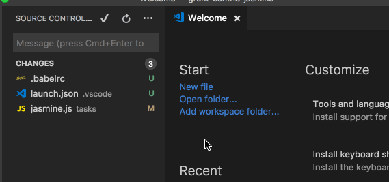

# git-coauthors README

## Features

Easily adds co-authored-by strings to your commit message.

Just select 'Change pairing buddies' and a list of the repo contributors will show up. You can add / remove them from here.

Whenever you're ready to write a commit, run the command 'Add co-author strings', and the extension will automatically add the name & email so github can identify them.

Usage Example

## Known Issues

The extension will not work properly if the VSCode git extension has not loaded when you select a command.

## Release Notes

### 0.1.0

Initial release
